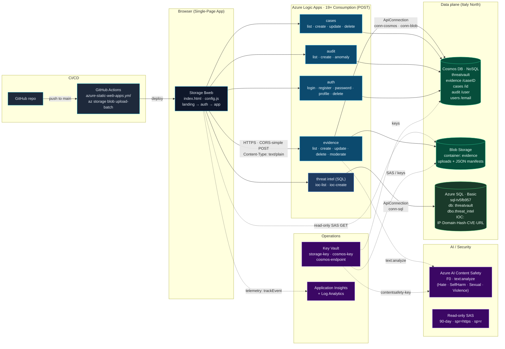

# ThreatVault — COM682 Cloud Native Development (CW1 + CW2)

ThreatVault is a cloud-native digital-evidence vault for SOC and DFIR analysts.
Binary evidence lives in **Azure Blob Storage**, metadata + users + audit log in
**Azure Cosmos DB (NoSQL)**, threat-intelligence IOCs in **Azure SQL Database**,
every CRUD path is served by an **Azure Logic App** (19 workflows, one per
operation), and the front-end is hosted on the **Storage Account static-website
(`$web`)** container behind a CI/CD pipeline. Telemetry flows into **Application
Insights** + **Log Analytics**; secrets are kept in **Azure Key Vault**. **Azure
AI Content Safety** auto-flags abusive evidence, **read-only SAS tokens** gate
blob downloads, and a threshold-based **audit anomaly scan** highlights burst
behaviour. Region is pinned to **Italy North**.

---

## Architecture



The 17 NoSQL Logic Apps share two API connections (`conn-cosmos`, `conn-blob`).
The two SQL Logic Apps (`la-ioc-list`, `la-ioc-create`) use a dedicated
`conn-sql` connection to **Azure SQL Database** — a separate, additive layer
that demonstrates SQL alongside NoSQL without touching the existing infrastructure.
Auth workflows hash passwords client-side (SHA-256 of `email:password`); the
Cosmos `users` container is partitioned by `/email`.

---

## Repository layout

```
.
├── index.html                       # Single-page front-end (landing → auth → app)
├── config.js                        # Endpoints + AppI conn-string (auto-generated)
├── staticwebapp.config.json         # Routing/headers
├── .github/workflows/
│   └── azure-static-web-apps.yml    # CI/CD — uploads to $web on push to main
└── infra/
    ├── parameters.sh                # Central names, suffix pinning, helpers
    ├── deploy-all.sh                # Master deploy script (00 → 09 → 05 → 08)
    ├── teardown.sh                  # az group delete --no-wait
    ├── 00-prereqs.sh                # Provider registration + RG
    ├── 01-storage.sh                # Storage account + `evidence` container + 90d SAS
    ├── 02-cosmos.sh                 # Cosmos DB + 4 containers (incl. users)
    ├── 03-monitor.sh                # Log Analytics + App Insights + Key Vault
    ├── 04-connections.sh            # Logic Apps API connections (cosmos, blob)
    ├── 05-logicapps.sh              # 17× Logic App workflows (substitutes CS creds)
    ├── 06-static-site-storage.sh    # Enable `$web` static website on storage
    ├── 07-write-config.sh           # Generate config.js (endpoints, AppI, SAS)
    ├── 08-setup-gh-secrets.sh       # Push AZURE_STORAGE_{ACCOUNT,KEY} to GitHub
    ├── 09-ai.sh                     # Azure AI Content Safety (F0) + KV secrets
    ├── 10-sql.sh                    # Azure SQL Server + `threatvault` DB + threat_intel table
    ├── 11-sql-logicapps.sh          # conn-sql + la-ioc-list + la-ioc-create; regenerates config.js
    ├── sql/
    │   └── init.sql                 # CREATE TABLE dbo.threat_intel (generated by 10-sql.sh)
    └── logicapps/
        ├── _connections.json        # ARM template — Cosmos + Blob API connections
        ├── _template.json           # ARM template — generic Logic App wrapper (NoSQL)
        ├── _sql-connections.json    # ARM template — SQL API connection (conn-sql)
        ├── _sql-template.json       # ARM template — SQL Logic App wrapper
        ├── la-evidence-*.def.json   # 5× evidence (CRUD + moderate)
        ├── la-cases-*.def.json      # 4× cases CRUD definitions
        ├── la-audit-*.def.json      # 3× audit (list, create, anomaly) definitions
        ├── la-auth-*.def.json       # 5× auth (login, register, password,
        │                            #          profile, delete) definitions
        ├── la-ioc-list.def.json     # Threat Intel — list top 100 IOC rows (SQL)
        └── la-ioc-create.def.json   # Threat Intel — insert IOC row (SQL)
```

---

## Prerequisites

* Azure subscription with Contributor on the target subscription
* `az` CLI ≥ 2.55 (already `az login`'d)
* `gh` CLI authenticated against the GitHub repo (used by step 08)
* `bash`, `jq`, `python3`
* `sqlcmd` (optional — falls back to Portal Query Editor instructions if absent)

---

## Deploy

```bash
# Provision every Azure resource and push secrets to GitHub
bash infra/deploy-all.sh

# Add Azure SQL + IOC Logic Apps (additive — safe to run after deploy-all)
bash infra/10-sql.sh
bash infra/11-sql-logicapps.sh   # also regenerates config.js

# Trigger the CI deploy
git push origin main
```

`deploy-all.sh` runs `00 → 04 → 09 → 05 → 06 → 07 → 08` in sequence. Each
script is idempotent: the suffix is persisted in `infra/.state.suffix` so
re-runs **reuse** existing storage / cosmos / static-website resources rather
than creating duplicates. ARM workflow names are constants, so step 05 updates
the existing 17 Logic Apps in place — but the trigger SAS signatures **rotate**
on every redeploy, which is why step 07 must always follow step 05 (it
regenerates `config.js`). Step 09 provisions Content Safety **before** step 05
so its endpoint/key can be substituted into `la-evidence-moderate` at deploy
time. Steps 10 and 11 are additive and can be run at any point after step 04.

### Teardown

```bash
bash infra/teardown.sh   # az group delete --no-wait
```

---

## Rubric coverage

### CW2

| Rubric criterion | Where it's met |
| --- | --- |
| **Storage for binary data (Blob)** | `01-storage.sh` — `evidence` container; `la-evidence-create` writes manifests, `la-evidence-delete` removes them |
| **NoSQL storage** | `02-cosmos.sh` — Cosmos DB SQL API, **4 containers** (`evidence` `/caseID`, `cases` `/id`, `audit` `/user`, `users` `/email`) |
| **REST CRUD API (Logic Apps)** | `05-logicapps.sh` + `logicapps/la-*.def.json` — **17 endpoints** covering evidence, cases, audit (incl. anomaly), the five auth flows, and Content Safety moderation |
| **Authentication & user management** | `la-auth-{login,register,password,profile,delete}.def.json` — client-side SHA-256 hashing, partitioned by `/email`, every action audited |
| **CI/CD via Git** | `.github/workflows/azure-static-web-apps.yml` — push to `main` ⇒ `az storage blob upload-batch` to `$web` |
| **Application Insights / Monitor** | `03-monitor.sh` — workspace-based App Insights wired into front-end via `config.js` |
| **Key Vault** | `03-monitor.sh` — stores `storage-key`, `cosmos-key`, `cosmos-endpoint` |
| **Region: Italy North** | `parameters.sh` `LOCATION=italynorth`, tagged on every resource |

### CW1

| Rubric criterion | Where it's met |
| --- | --- |
| **SQL database** | `10-sql.sh` — Azure SQL Server `sql-tv5fb957`, database `threatvault`, table `dbo.threat_intel` (IOC: IP · Domain · Hash · CVE · URL); accessed via `la-ioc-list` and `la-ioc-create` |
| **NoSQL database** | Cosmos DB (see CW2 above) |
| **Both SQL and NoSQL demonstrated** | SQL: fixed-schema IOC records with `IDENTITY` PK, `DATETIME2` default, SQL query via `Execute SQL query` action. NoSQL: schema-flexible JSON documents partitioned by logical key — two distinct storage paradigms in one application |

### Advanced features

| Feature | Implementation |
| --- | --- |
| **Azure AI Content Safety — auto-flagging** | `09-ai.sh` provisions a Content Safety F0 account; `la-evidence-moderate` POSTs evidence text to `text:analyze` (Hate/SelfHarm/Sexual/Violence, FourSeverityLevels). Severity ≥ 4 ⇒ workflow patches `flagged:true` + `contentModeratorStatus:rejected` onto the Cosmos doc. The frontend fires this fire-and-forget after every `evidenceCreate` and re-renders with a red flag badge if positive. |
| **Read-only SAS blob downloads** | `01-storage.sh` mints an account-key-signed, 90-day, `sp=r&spr=https` SAS at deploy time and `07-write-config.sh` injects it into `config.js → storage.evidenceSas`. The evidence modal exposes a **Download (SAS)** anchor — the analyst gets a read-only URL with no Cosmos round-trip. |
| **Application Insights — distributed telemetry** | `index.html` lazy-loads `ai.3.gbl.min.js` after `config.js` and exposes `window.__tvTrack(name, props)`. Custom events: `Auth.Login`, `Auth.Register`, `Evidence.Create`, `Case.Create`, `LogicApp.Error`, plus auto-pageviews; user context set via `setAuthenticatedUserContext` after login. |
| **Audit anomaly scan** | `la-audit-anomaly` returns the audit log; the dashboard **AI Anomaly Signals** card groups entries by `user` over the last 60 minutes and red-highlights any user crossing a configurable threshold (default 5). Inline panel shows status banner, per-user activity bars, and recent events — no extra Cosmos schema. |
| **Threat Intelligence IOC table (SQL)** | `dbo.threat_intel` stores structured IOC records (type, value, severity, source, description). `la-ioc-create` inserts via Logic Apps SQL connector; `la-ioc-list` queries top 100 ordered by date. Demonstrates SQL fixed-schema alongside Cosmos flexible-schema in the same application. |

### CORS note

Logic Apps Consumption can't natively answer the OPTIONS preflight, so the
front-end issues **CORS-simple** requests by sending `Content-Type: text/plain`
in `lcCall()` (no preflight needed). Each workflow returns
`Access-Control-Allow-Origin: *` in its `Response` action.

### Static-site hosting note

Azure Static Web Apps is not available in regions permitted by the current
subscription policy, so the front-end is hosted on the storage account's
`$web` static-website endpoint — same CDN-style delivery, deployed by the
GitHub Actions workflow on every push to `main`.

---

## Authentication flow

The app is **purely live** — there is no demo / fallback mode. First-run users
must register, which triggers `la-auth-register` to insert a user document into
Cosmos `users` (partition `/email`) and write an `ACCOUNT_REGISTER` row to
`audit`. Subsequent logins, profile edits, password changes, and account
deletions all hit their dedicated Logic App and produce a corresponding audit
entry.

Passwords are SHA-256-hashed client-side (`hashPwd(email, password)` in
`index.html`) — the plaintext never leaves the browser.

---

## Video walkthrough script (≈5 min)

1. **00:00** — open the static-site URL; landing page hero loads.
2. **00:20** — click **Get started** → register a new account → land on the
   dashboard. Open Azure Portal → Cosmos DB → `users` container; show the new
   doc with email partition key and SHA-256 `passwordHash`.
3. **01:00** — pan over the resource group `rg-threatvault`: storage, cosmos,
   **19** Logic Apps (17 NoSQL + 2 SQL), App Insights, Key Vault, Log Analytics,
   Content Safety, **Azure SQL Server**. Confirm all are in **Italy North**.
4. **01:45** — back in the app, create a Case → show it appear in Cosmos
   `cases` container.
5. **02:15** — submit Evidence linked to the case → show:
   * new doc in Cosmos `evidence` container (SHA-256 hash, partitioned by `caseID`)
   * uploaded media + JSON manifest in Blob container `evidence`
   * **Download (SAS)** button — opens the blob via the read-only SAS URL.
   * Submit a second evidence with abusive notes — Content Safety auto-flags it.
6. **03:00** — open the Audit tab → entries for `LOGIN`, `CREATE`, `UPLOAD`;
   open the same `audit` container in Cosmos. Click **Anomaly Scan** — the
   analyst with 7 actions in the last 60 min lights up red.
7. **03:30** — Portal → Azure SQL Database `threatvault` → **Query Editor** →
   `SELECT * FROM dbo.threat_intel` to show the SQL layer alongside Cosmos.
8. **04:00** — Application Insights → Live Metrics; refresh the SPA; show
   page-views + custom events (`Auth.Login`, `Evidence.Create`, …).
9. **04:20** — Key Vault → show `storage-key`, `cosmos-key`, `cosmos-endpoint`.
10. **04:35** — GitHub repo → tiny edit to `index.html`, push to `main`, show
    the Actions run uploading to `$web`, then hard-refresh the site.
11. **04:55** — wrap up: rubric checklist superimposed.

---

## Credential-leak prevention

1. Install the scanner: `pip install detect-secrets`
2. Enable repo hooks: `git config core.hooksPath .githooks`
3. (Optional) Refresh the baseline: `detect-secrets scan > .secrets.baseline`

The pre-commit hook scans every diff for high-entropy strings before letting
the commit land — protects against accidental leaking of Logic App SAS tokens
or Cosmos primary keys.
